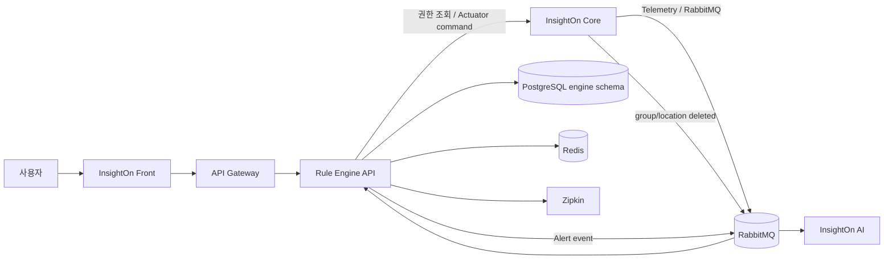
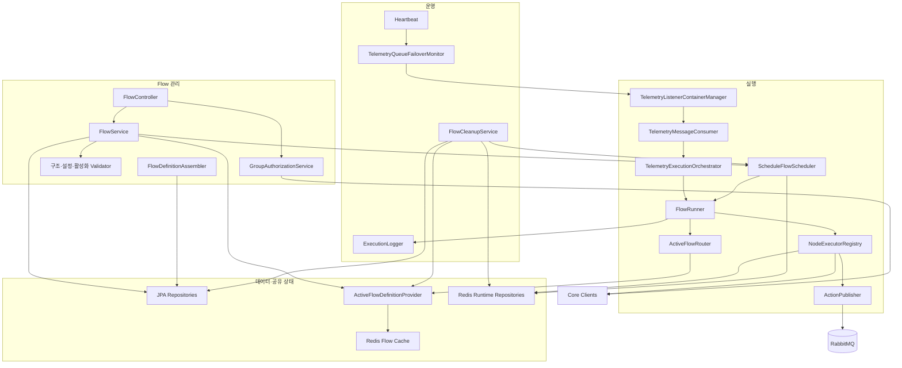
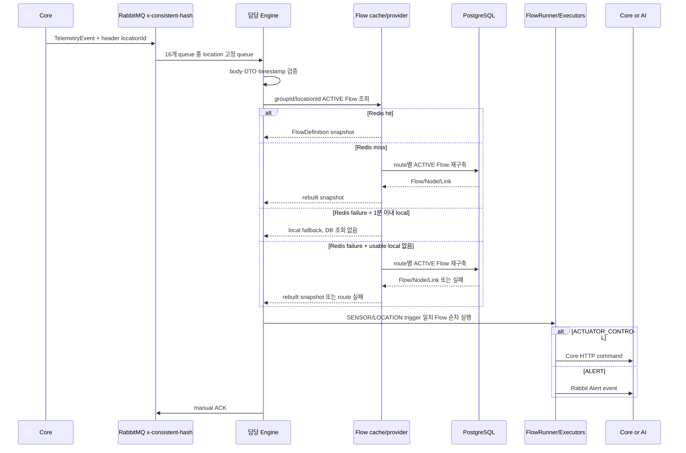
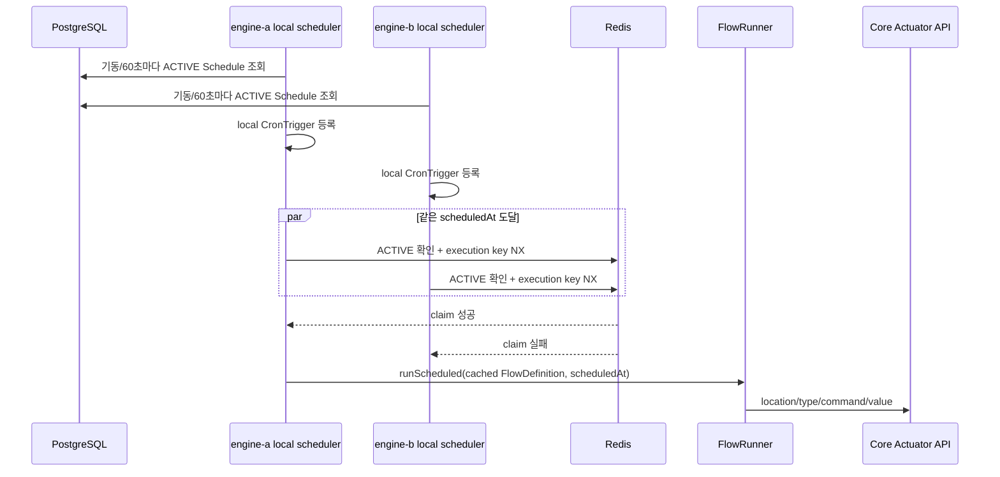
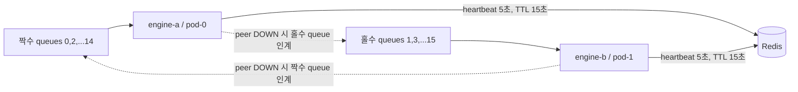
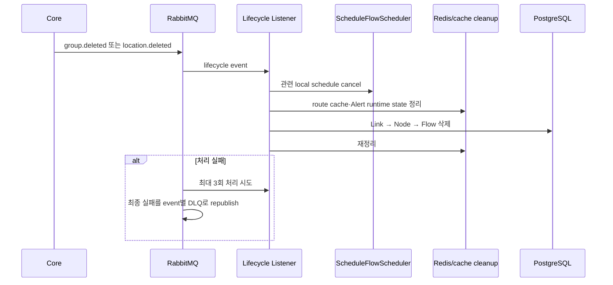

# 시스템 아키텍처

## 1. 시스템 문맥

### 시스템별 책임

| 시스템 | 책임 |
|---|---|
| Front | Flow 편집·조회 UI와 API 요청 조립 |
| Gateway | 외부 진입점, 사용자 식별 헤더의 신뢰 경계 |
| Rule Engine | Flow 검증·저장·라우팅·실행·분산 상태 |
| Core | 그룹·장소·센서·액추에이터 원본, telemetry 발행, 액추에이터 명령 접수·상태 및 실행 로그 저장. 물리 장비 전달은 미확인 |
| AI | Alert 이벤트 저장·조회·알림 경험 |
| RabbitMQ | telemetry 분산 queue, lifecycle 및 Alert 비동기 전달 |
| PostgreSQL | Flow/Node/Link의 영속 원본 |
| Redis | Flow 실행 snapshot과 분산 runtime 상태·heartbeat |

## 2. 엔진 내부 컴포넌트

## 3. 저장·실행 경계

### PostgreSQL

- `Flow`, `Node`, `Link`의 원본이다.
- CRUD와 기동·주기 Schedule 재조정, cache miss 복구에 사용한다.
- 고빈도 telemetry hot path에서 매 패킷 조회하지 않는다.

### Redis

- route별 ACTIVE `FlowDefinition` snapshot을 보관한다.
- Alert count/cooldown, Timer interval, Schedule active/execution claim, heartbeat를 공유한다.
- 원본 DB를 대체하지 않는다.

### 로컬 메모리

- 최근 route snapshot은 생성 후 기본 1분까지만 fallback으로 사용할 수 있다. 1분은 물리적 map eviction 시간이 아니다.
- 이 최대 사용 시간은 Redis 조회 실패 때 쓰는 로컬 fallback에만 적용된다. DB commit 후 Redis 갱신이 실패해 Redis에 이전 값이 남는 경우에는 별도 version 검증 없이 Flow cache TTL까지 읽힐 수 있다.
- stale telemetry watermark를 인스턴스별로 보유한다.
- 등록된 cron task와 반복 실패 억제 상태를 보유한다.

## 4. 텔레메트리 실행 시퀀스

실패 의미:

- body·DTO 오류, stale packet, runtime 오류는 모두 ACK 후 폐기한다.
- telemetry에 application retry, requeue, DLQ가 없다.
- `FlowRunner`는 Flow별 오류를 흡수하므로 한 Flow 실패가 다음 Flow를 막지 않는다.
- route 전체를 불러오지 못하면 해당 패킷의 Flow 실행은 중단된다.
- 한 패킷의 후보 Flow는 순차 실행하지만 조회 정렬과 Flow 우선순위 계약이 없어 여러 Flow 사이의 상대 순서는 보장되지 않는다. 서로 다른 queue consumer는 병렬로 실행된다.

## 5. Schedule 실행 시퀀스

핵심 정책:

- Schedule 이벤트를 RabbitMQ에 넣지 않는다.
- 실행 직전 DB를 조회하지 않는다.
- Redis state가 ACTIVE이고 claim을 얻은 경우에만 실행한다.
- Redis 장애 시 실행을 건너뛴다.
- 선점 이후 프로세스 또는 Core 호출 실패도 재시도하지 않는다.
- 중단 중 놓친 실행을 재기동 후 보정하지 않는다.

## 6. Queue ownership과 failover

- 각 queue는 consumer 1개를 사용한다.
- 상대 heartbeat TTL 15초가 만료된 뒤 최대 5초 주기의 다음 점검에서 peer의 8개 queue listener를 시작한다.
- 상대 heartbeat가 복구되면 takeover listener를 중지한다.
- Redis heartbeat 조회 자체가 실패하면 DOWN으로 간주하지 않고 전환을 보류한다.
- hostname 끝 ordinal이 `0` 또는 `1`이 아니면 production ownership이 자동 설정되지 않는다.

이 구조는 정확히 2개 인스턴스 전용이다. replica를 늘리는 것은 설정 변경이 아니라 ownership·heartbeat 모델 재설계 작업이다.

## 7. Core lifecycle 정리 시퀀스

Schedule cancel과 cache eviction을 DB 삭제 전에 수행해 삭제된 Flow의 cached definition이 실행될 수 있는 경합 구간을 줄인다. Sensor·Actuator 삭제 이벤트는 현재 Engine이 수신하지 않는다.

## 8. 장애 경계

| 장애 | 현행 동작 | 데이터·사용자 영향 |
|---|---|---|
| Redis Flow cache | 최근 local snapshot 또는 route DB 재구축 | 둘 다 실패하면 해당 packet의 route 중단 |
| Redis runtime state | Timer 실패, 상태가 필요한 Alert 실패, Schedule 미실행, heartbeat 판단 보류 | `requiredCount=1`, `cooldown=0` Alert는 Redis를 우회. 자동 재시도 없음 |
| PostgreSQL | API와 cache rebuild, Schedule reconcile 실패 | 이미 실행 중인 인스턴스는 Redis/local snapshot으로 제한적 telemetry 가능. 신규 인스턴스의 cache·Schedule warm-up 기동은 보장되지 않음 |
| RabbitMQ telemetry | Engine이 패킷을 받지 못함 | Core producer도 fail-silent drop 정책 |
| RabbitMQ Alert | Action 실패로 기록 | Alert count/cooldown 전이는 이미 반영됐을 수 있음 |
| Core 권한 API | Flow API 502 | 읽기·쓰기 모두 중단 |
| Core actuator API | 해당 Flow Action 실패 | 사용자 실행 이력 없음, 운영 로그만 존재 |
| 한 Engine 종료 | 15초 TTL 만료 후 다음 5초 점검에서 peer가 queue takeover | 이론상 약 20초와 실제 listener 전환 지연 가능 |

## 9. 아키텍처상 의도적으로 하지 않는 것

- 모든 Node마다 별도 microservice나 queue를 두지 않는다.
- Schedule 실행을 라우팅 목적으로 RabbitMQ 왕복시키지 않는다.
- 텔레메트리 실행 전에 DB에서 ACTIVE를 매번 재확인하지 않는다.
- Redis 장애 중 오래된 local snapshot을 무기한 사용하지 않는다.
- 고빈도 정상 패킷을 INFO 로그로 기록하지 않는다.
