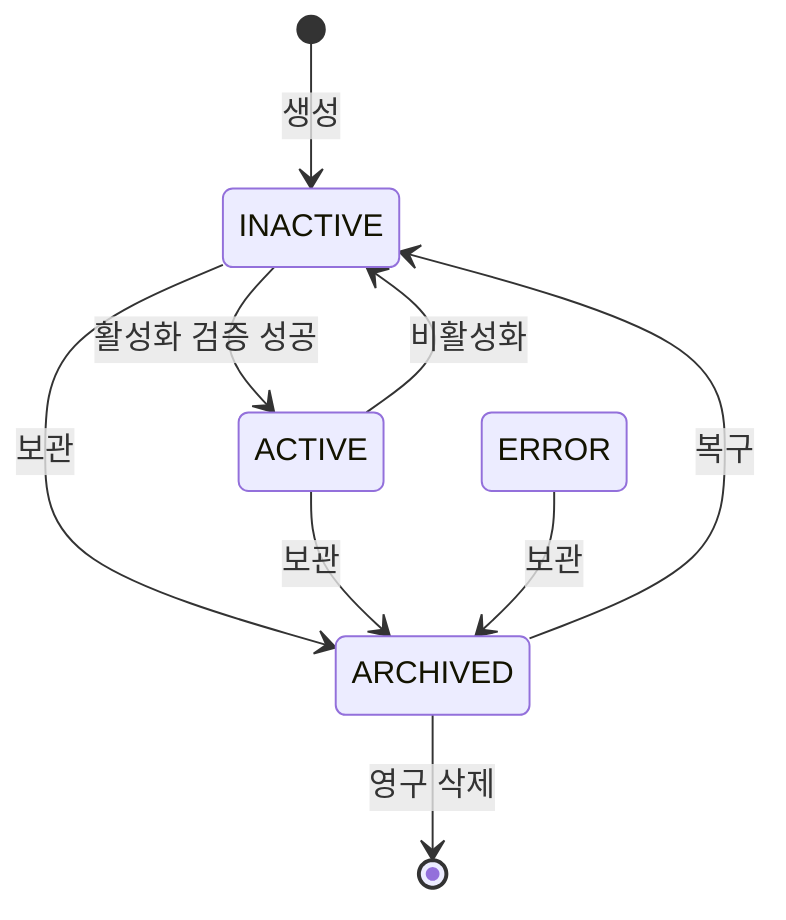

# 상세 설계서

## 1. 설계 단위와 책임

| 패키지·컴포넌트 | 책임 | 하지 않는 일 |
|---|---|---|
| `flow.api` | REST 입력·응답과 조회 조건 분기 | 실행·영속 정책 |
| `flow.application.FlowService` | 권한 확인 후 Flow transaction과 runtime 갱신 조정 | 패킷 실행 |
| `flow.application.validation` | 요청 구조, 포트, 경로, 설정, 활성화 가능성 검증 | 외부 장치의 실제 존재 확인 |
| `flow.domain` | Flow 상태 전이, NodeType·port·params 계약 | JPA 연관관계 탐색 |
| `flow.application.assembly` | Flow/Node/Link를 불변 `FlowDefinition`으로 조립 | 캐시 정책 |
| `runner.infrastructure.cache` | route별 ACTIVE Flow snapshot과 Redis 장애 fallback | 영구 원본 역할 |
| `runner.application.router` | 이벤트에 맞는 SENSOR/LOCATION Flow 선택 | Schedule route |
| `runner.application.FlowRunner` | 경로 순회, Action fan-out과 executor 호출·격리 | retry와 실행 이력 저장 |
| `runner.execution.executor` | NodeType별 작은 실행 단위 | Flow 전체 순회 |
| `runner.application.schedule` | cron 등록·취소·재조정·실행 선점 | RabbitMQ 재라우팅 |
| `runner.application.telemetry` | stale 검사와 queue failover 조정 | 메시지 재시도 |
| `runner.observability` | 실행 로그·오류 분류·counter | 사용자용 이력 |
| `flow.application.cleanup` | Core lifecycle에 따른 schedule/cache/state/DB 정리 | sensor/actuator 삭제 처리 |

현행 클래스는 위 경계 안에서 대체로 응집돼 있다. Schedule scheduler, cache provider, execution logger를 파일 수를 늘려 더 세분화하는 것은 현재 규모에서 이점보다 탐색 비용이 크다.

## 2. Flow 생명주기



`ERROR`는 enum과 보관 전이만 존재한다. 현재 어떤 실행·lifecycle 경로도 Flow를 ERROR로 바꾸지 않는다.

### 2.1 생성

1. Core에서 요청자의 MANAGER 이상 역할을 확인한다.
2. DTO와 Node configuration을 검증한다.
3. 그래프 구조를 검증한다.
4. `(groupId, locationId, name)` 중복을 확인한다.
5. Flow를 INACTIVE로 저장한다.
6. 요청의 `clientNodeKey`를 생성된 nodeId에 매핑해 Node와 Link를 저장한다.

### 2.2 활성화

1. 저장된 전체 FlowDefinition을 조립한다.
2. 구조를 다시 검증한다.
3. 모든 NodeType에 executor가 있는지 확인한다.
4. params를 다시 parse하고 Threshold 문법을 검증한다.
5. DB 상태를 ACTIVE로 변경한다.
6. commit 이후 route snapshot을 교체한다.
7. Schedule Flow라면 commit 이후 로컬 cron을 등록하고 Redis ACTIVE state를 기록한다.

### 2.3 수정

수정은 in-place가 아닌 새 버전 생성 방식이다.

1. 기존 Flow가 ARCHIVED가 아닌지 확인한다.
2. 새 정의를 검증한다.
3. 새 ID의 INACTIVE Flow/Node/Link를 생성한다.
4. 기존 Flow를 ARCHIVED로 변경한다.
5. commit 이후 기존 route snapshot을 재구축하고 기존 Schedule을 취소한다.

현재 unique는 ARCHIVED를 포함한 모든 상태에 적용되므로 기존 이름을 그대로 쓴 수정은 새 Flow 저장 전에 충돌한다. 이 문제는 별도 정책 결정 전까지 보류돼 있다.

## 3. 그래프 모델

### 3.1 역할과 포트

| Category | NodeType | 출력 포트 |
|---|---|---|
| Trigger | SENSOR, LOCATION, SCHEDULE | `out` |
| Filter | THRESHOLD, TIME_WINDOW, TIMER | `true`, `false` |
| Action | ACTUATOR_CONTROL, ALERT, EXTERNAL_NOTIFICATION | 없음 |

모든 입력 포트 이름은 `in`이다.

### 3.2 구조 규칙

- Trigger 정확히 1개, Action 1개 이상
- Trigger 입력 금지, Action 출력 금지
- 동일 `(source node, source port)`의 복수 Link는 모든 target이 Action일 때만 허용
- 출발·도착 Node와 Port가 모두 같은 Link 중복은 금지
- 모든 Node는 Trigger에서 도달 가능
- 모든 비Action Node는 적어도 하나의 Action으로 이어짐
- self-loop와 cycle 금지
- Trigger는 `out` Link 필수
- Filter는 `true` Link 필수, `false` Link 선택
- Schedule의 `out`은 하나 이상의 ACTUATOR_CONTROL로 직접 연결

따라서 Schedule Flow는 Filter를 거치지 않지만 복수 ACTUATOR_CONTROL로 fan-out할 수 있다.

### 3.3 분기·합류 의미

- 한 executor는 한 output port만 반환한다.
- 한 source port가 여러 Action으로 연결되면 Link ID 순서대로 Action을 모두 실행한다.
- Action이 아닌 target이 하나라도 포함된 fan-out은 검증과 실행 방어에서 거부한다.
- Action 하나가 실패하면 현재 실행은 실패로 종료하고 아직 실행하지 않은 Action은 실행하지 않는다. 실패 격리와 부분 성공 기록은 후속 범위다.
- Filter의 true와 false가 서로 다른 Action으로 갈 수는 있지만 한 실행에서 둘 중 하나만 실행된다.
- 여러 Link가 같은 target으로 들어오는 구조는 명시적으로 금지되지 않는다. 다만 join·AND·여러 입력 대기 의미는 없고, 현재 실행 경로가 도달했을 때 한 번 실행할 뿐이다.
- `ErrorCode.FLOW_FAN_IN_NOT_ALLOWED`는 현재 검증 코드에서 사용되지 않는 과거 잔여 값이다.

## 4. 실행 알고리즘

### 4.1 Telemetry Flow

```text
validate message
→ reject stale timestamp
→ load ACTIVE FlowDefinition list by group/location
→ keep LOCATION flows and matching SENSOR flows
→ for each flow:
     find the single trigger
     while current node exists:
         reject revisiting node
         execute NodeExecutor
         if Action result is terminal: finish
         select links by output port
         if false Filter has no link: finish normally
         if one target: move to target node
         if multiple Action targets: execute all in Link ID order
     catch and log this flow's failure
→ ACK original message
```

한 packet 안의 Flow 목록과 한 Flow의 node 실행은 순차적이다. Action fan-out도 병렬화하지 않고 Link ID 오름차순으로 실행한다. 다만 Flow repository 조회에 `ORDER BY`가 없고 Flow priority 모델도 없어 여러 Flow의 상대 실행 순서는 계약상 비결정적이다. 서로 다른 Rabbit queue는 별도 consumer에서 병렬 처리되므로 location이 다른 패킷까지 전역 순차 실행되는 것은 아니다.

stale watermark는 Flow 실행 전에 인스턴스 로컬 Caffeine에 기록된다. 이후 Flow가 실패해도 같은 인스턴스에 같은 timestamp가 다시 오면 stale로 폐기된다. 재시작·failover 때 watermark는 사라지며, takeover/handback 전환 중 두 consumer가 잠시 공존하는 경우까지 전역 중복 차단을 보장하지 않는다.

### 4.2 Schedule Flow

```text
local CronTrigger fires
→ read the captured scheduledAt
→ Redis Lua: schedule state must be ACTIVE
              and execution key must not exist
→ claim success: runScheduled(cached FlowDefinition)
→ execute ScheduleNode(out)
→ call one or more ActuatorControlNode in Link ID order
```

실행 중 DB 재조회는 없다. 비활성화·삭제 경합은 Redis ACTIVE state와 local cancel, 주기 재조정으로 줄인다. 다만 DB 상태 commit과 afterCommit callback은 한 transaction이 아니므로 commit 직후 Redis INACTIVE·local cancel 전까지 기존 작업이 마지막 한 번 선점할 수 있고, callback 실패 시 다음 재조정까지 stale 상태가 남을 수 있다. 취소는 `ScheduledFuture.cancel(false)`이므로 이미 시작해 claim까지 얻은 작업은 중단되지 않고 Core 호출까지 진행할 수 있다.

## 5. Node 상세 계약

### 5.1 SENSOR

```json
{ "sensorId": 101 }
```

- `sensorId`: 양수 Long
- route 단계에서 이벤트 sensorId와 일치하는 Flow만 남긴다.
- executor는 configuration을 재검증하고 `out`으로 진행한다.

### 5.2 LOCATION

```json
{}
```

- 같은 group/location에서 들어온 모든 센서 패킷이 후보가 된다.
- Flow location과 event location 일치를 방어적으로 확인한다.
- 현재 이벤트의 metrics만 후속 Filter에 제공한다.
- 장소 내 센서들의 최신 값을 합친 aggregate snapshot은 만들지 않는다.

### 5.3 SCHEDULE

```json
{ "cron": "0 0 9 * * MON-FRI" }
```

- Spring 6필드 cron이고 첫 seconds 필드는 정확히 `0`이어야 한다.
- 기본 zone은 `Asia/Seoul`이다.
- 반복 예약만 지원한다. 일회성 timestamp는 없다.
- 서버 중단 중 놓친 실행은 건너뛴다.
- weekday/weekend/monthly 표현은 cron 자체로 가능하지만 별도 의미형 DTO는 없다.

### 5.4 THRESHOLD

```json
{ "expression": "#metrics['temperature'] > 28" }
```

- 1~1,000자 SpEL
- `SimpleEvaluationContext.forReadOnlyDataBinding()` 사용
- 변수: `#event`, `#metrics`
- 결과는 boolean이어야 한다.
- expression cache는 최대 1,024개에 도달하면 전체 clear 후 다시 채운다.

### 5.5 TIME_WINDOW

```json
{ "startTime": "08:30:00", "endTime": "18:00:00" }
```

- 실행 context timestamp를 Schedule과 같은 전역 zone으로 변환한다.
- 일반 구간은 `start <= time < end`다.
- start가 end보다 늦으면 자정을 통과하는 구간이다.
- start와 end가 같으면 거부한다.
- 현재 Schedule 뒤에는 배치할 수 없어 Telemetry Flow에서만 실질 사용된다.

### 5.6 TIMER

```json
{ "intervalSeconds": 300 }
```

- 양수 int
- Redis key `(nodeId, locationId)`를 NX+TTL로 선점한다.
- 선점 성공만 true, 나머지는 false다.
- interval 동안 실제 Action 성공 여부와 무관하게 억제된다.
- 현재 Schedule 뒤에는 배치할 수 없다.

### 5.7 ACTUATOR_CONTROL

```json
{
  "actuatorType": "AIRCON",
  "command": "temperature",
  "commandValue": "24"
}
```

| actuatorType | command | 허용 값 |
|---|---|---|
| AIRCON | `power` | ON, OFF |
| AIRCON | `mode` | COOL, DRY, FAN, AUTO |
| AIRCON | `temperature` | 18~30 숫자 |
| AIR_PURIFIER | `power` | ON, OFF |
| AIR_PURIFIER | `mode` | AUTO, SLEEP, TURBO |
| VENTILATION_FAN | `power` | ON, OFF |
| VENTILATION_FAN | `mode` | LOW, MID, HIGH |

- Engine이 `callerService=RULE_ENGINE`을 추가해 Core에 동기 요청한다.
- 정규 계약은 `actuatorType` 대문자, `command` 소문자, enum형 `commandValue` 대문자다. Engine과 Core의 검증은 일부 대소문자를 무시하지만 원문을 전달·저장하므로 비정규 입력은 Core 상태 JSON에 별도 key를 만들 수 있다.
- Core는 같은 location과 actuatorType의 액추에이터 전체에 상태 변경을 적용한다.
- 현재 Core 코드에서 확인되는 성공은 DB `currentState`와 run log 갱신까지다. 실제 MQTT/장비 전달 완료 의미는 확인되지 않았다.

### 5.8 ALERT

```json
{
  "title": "고온 감지",
  "message": "온도를 확인해 주세요.",
  "severity": "WARNING",
  "requiredCount": 3,
  "countTimeoutSeconds": 300,
  "cooldownSeconds": 1800
}
```

- title: 1~200자
- message: 1~2,000자
- severity: `INFO`, `WARNING`, `CRITICAL`
- requiredCount: 1 이상, 기본 3
- requiredCount가 2 이상이면 countTimeoutSeconds 양수, 기본 300초
- cooldownSeconds: 0 이상, 기본 1,800초

Redis Lua 처리 순서:

1. cooldown key가 있으면 publish하지 않는다.
2. requiredCount=1이면 필요 시 cooldown을 만들고 통과한다.
3. 그 외 count를 증가시키고 최초 count에 timeout을 설정한다.
4. requiredCount에 도달하면 count를 지우고 cooldown을 만든 뒤 통과한다.
5. 통과 후 AI Alert 이벤트를 발행한다.

Rabbit 발행이 실패해도 count reset과 cooldown 생성은 이미 끝났을 수 있다. 자동 재시도는 없다.

### 5.9 EXTERNAL_NOTIFICATION

```json
{ "channel": "TELEGRAM" }
```

- `TELEGRAM` 또는 `EMAIL` configuration 타입만 있다.
- executor, client, publisher가 없다.
- 저장은 가능하지만 ACTIVE 전환에서 unsupported executor 오류로 거부된다.
- 코드 주석의 “best effort 전송”은 구현된 사실이 아니다.

## 6. 활성 Flow snapshot 설계

- cache key 단위는 `(groupId, locationId)`다.
- 값은 해당 route의 ACTIVE FlowDefinition 전체 목록이다.
- Redis `SET`으로 한 key를 통째 교체해 부분 갱신 상태를 피한다.
- API transaction commit 이후 route를 DB에서 다시 조립해 Redis와 local snapshot을 갱신한다.
- Redis miss는 인스턴스 로컬 route별 lock으로 그 인스턴스 안에서 한 thread만 DB를 재구축한다. 여러 인스턴스 전체의 single-flight를 보장하지 않는다.
- Redis 장애가 감지되면 5초 동안 재접근을 억제하고 1분 이하 local snapshot을 우선 사용한다.
- local snapshot이 없거나 만료되면 route별 DB rebuild를 시도한다.

이 구조는 DB를 원본으로 유지하면서 packet마다 DB를 조회하는 병목을 피한다. 그러나 afterCommit 갱신은 DB transaction과 원자적이지 않고, Redis 저장 실패 뒤 남은 이전 Redis 값에는 local fallback의 1분 제한이 적용되지 않는다. 그 값은 기본 30분 cache TTL 동안 정상 hit로 읽힐 수 있으므로 현행 보장은 eventual consistency다.

## 7. 실패와 복구 상태

실행 오류 분류:

| 종류 | 대표 원인 | 로그 |
|---|---|---|
| `TRANSIENT_DEPENDENCY` | Redis/AMQP, timeout, network, transient DB, Feign 5xx/408/429 | WARN |
| `PERMANENT_CONFIGURATION` | JSON, validation, SpEL, IllegalArgument | ERROR |
| `PERMANENT_REJECTED` | non-transient DB, 재시도 불가 Feign 4xx | ERROR |
| `INTERNAL` | 분류되지 않은 내부 오류 | ERROR |

동일 route 또는 Flow의 같은 실패 signature는 최초만 WARN/ERROR로 기록한다. 후속 동일 실패 수와 마지막 message를 상태에 누적하고 성공 시 INFO 복구 로그로 출력한다. 이 분류는 retry를 유발하지 않는다.

## 8. 동시성과 전달 의미

| 경로 | 보장 수준 | 설명 |
|---|---|---|
| Telemetry | best-effort, application retry 없음 | Core 발행 실패와 처리 오류는 drop. 단, Action 이후 ACK 전에 consumer가 종료되면 Rabbit redelivery와 중복 효과가 가능 |
| Schedule | 실행 시도 중복 억제 | Redis NX 선점 후 실패 시 재시도 없음 |
| Timer | interval당 최초 통과 선점 | 후속 Action 실패와 무관하게 TTL 유지 |
| Alert | count/cooldown 원자 전이 | Rabbit 최종 소비와 하나의 transaction이 아님 |
| Core lifecycle | 최대 3회 시도 후 DLQ | cleanup은 반복 호출 가능한 삭제 중심 동작 |
| Flow cache | eventual refresh + 사용 시간이 제한된 local fallback | DB commit 후 비원자 갱신. local fallback은 1분 제한이나 stale Redis 값은 cache TTL까지 남을 수 있음 |
