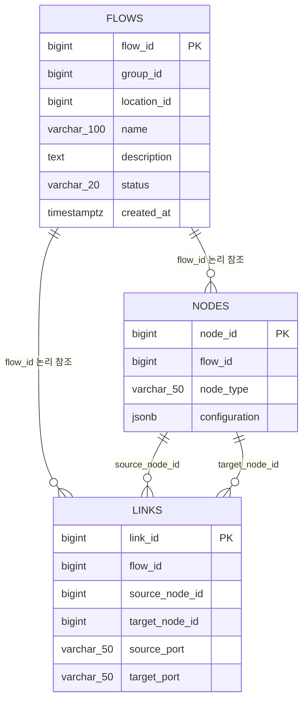

# 데이터·캐시 설계서

## 1. 데이터 소유 원칙

- PostgreSQL `engine` schema는 Flow 정의의 유일한 영속 원본이다.
- Redis route snapshot은 실행 성능과 다중 인스턴스 공유를 위한 파생 데이터다.
- Redis Alert/Timer/Schedule/heartbeat 값은 실행 중 공유 상태이며 DB로 복구되지 않는다.
- 로컬 메모리 snapshot과 watermark는 인스턴스 생명주기보다 오래 유지되지 않는다.

## 2. PostgreSQL 논리 모델



JPA 코드에는 `@ManyToOne` 등의 연관관계나 FK 선언이 없다. 참조 무결성과 삭제 순서는 애플리케이션이 관리한다.

### 2.1 `flows`

| 컬럼 | 제약·의미 |
|---|---|
| `flow_id` | identity PK |
| `group_id` | not null, Core group 논리 ID |
| `location_id` | not null, Core location 논리 ID |
| `name` | not null, 최대 100자, trim 저장 |
| `description` | TEXT, null 허용 |
| `status` | ACTIVE/INACTIVE/ARCHIVED/ERROR |
| `created_at` | UTC 생성 시각, 수정 불가 |

논리적으로 기대하는 제약·인덱스:

- unique `uk_flows_group_location_name(group_id, location_id, name)`
- index `idx_flows_group_id(group_id, status)`
- index `idx_flows_group_location_status(group_id, location_id, status)`

unique는 ARCHIVED에도 적용되므로 같은 이름 수정·재생성에 영향을 준다.

### 2.2 `nodes`

- `node_id` identity PK
- `flow_id`, `node_type`, `configuration` 모두 not null
- configuration은 PostgreSQL `jsonb`
- NodeType enum name을 문자열로 저장

Schedule 재조정은 ACTIVE Flow 중 SCHEDULE Node가 존재하는지 subquery로 찾는다. 데이터가 커지면 `nodes(flow_id, node_type)` 인덱스 후보를 `EXPLAIN ANALYZE`로 평가해야 한다.

### 2.3 `links`

- `link_id` identity PK
- `flow_id`, source/target node ID, source/target port 모두 not null
- unique `uk_links_flow_source_port(flow_id, source_node_id, source_port)`

이 unique는 한 output port에서 여러 Link로 fan-out하는 것을 DB에서도 막는 역할을 한다.

## 3. Schema 관리 현황

현재 설정은 다음과 같다.

```properties
spring.jpa.hibernate.ddl-auto=validate
spring.jpa.open-in-view=false
```

그러나 저장소와 인프라 저장소에서 다음 항목을 찾을 수 없다.

- Flyway migration
- Liquibase changelog
- 운영용 schema SQL
- 신규 환경 baseline 절차

따라서 애플리케이션은 schema가 없으면 기동에 실패하지만, 기대 schema를 누가 어떤 버전으로 생성하는지는 코드로 재현되지 않는다. JPA annotation에 적힌 index·unique·컬럼이 운영 DB에 실제로 모두 존재한다고 `validate`만으로 보장할 수 없다.

권장 후속 작업:

1. 현재 운영 schema를 역검증한다.
2. Flyway `V1__engine_baseline.sql`에 테이블·unique·index·필요한 FK 정책을 명시한다.
3. CI에서 빈 PostgreSQL에 migration 후 애플리케이션 context를 기동한다.
4. 기존 운영 DB에는 Flyway baseline 적용 절차를 별도로 마련한다.

## 4. Redis 키 카탈로그

| 키 형식 | 자료형·값 | 수명 | 작성·소비 |
|---|---|---|---|
| `rule-engine:flow-route:{groupId}:{locationId}` | JSON `List<FlowDefinition>` | 기본 30분 | Flow cache provider |
| `heartbeat:{engineId}` | engineId 문자열 | 기본 15초, 5초 갱신 | heartbeat/failover |
| `count:{flowId}:{nodeId}` | Alert 누적 횟수 | count timeout, 기본 300초 | Alert Lua |
| `cooldown:{flowId}:{nodeId}` | `1` | cooldown, 기본 1,800초 | Alert Lua |
| `timer:{nodeId}:{locationId}` | `1` | intervalSeconds | Timer NX |
| `schedule-state:{flowId}` | hash: status, version | TTL 없음 | Schedule 활성 상태 |
| `schedule-state-version` | 증가 Long | TTL 없음 | Schedule 재조정 순서 |
| `schedule-execution:{flowId}:{epochSecond}` | `1` | 기본 10분 | Schedule NX claim |

Flow route key만 `rule-engine:` namespace를 사용하고 나머지는 짧은 공용 prefix다. 다른 서비스와 같은 logical DB를 공유하지 않는 것이 안전하다.

## 5. ACTIVE Flow cache

### 5.1 정상 경로

1. `(groupId, locationId)`로 Redis snapshot을 조회한다.
2. 값이 있으면 route와 ACTIVE 상태, flowId 중복을 검증한다.
3. 검증된 불변 목록을 local snapshot에도 기억한다.
4. telemetry router가 Trigger만 추가 필터링한다.

### 5.2 Cache miss

1. route별 single-flight lock을 얻는다.
2. DB에서 해당 group/location의 ACTIVE Flow만 조회한다.
3. Node/Link를 `FlowDefinition`으로 조립한다.
4. local snapshot과 Redis key를 교체한다.

빈 목록도 snapshot으로 저장하므로 같은 route의 반복 miss가 DB를 계속 치는 것을 막는다.

### 5.3 Redis 장애

1. 최초 실패를 WARN하고 cache degraded 상태로 전환한다.
2. 5초 동안 Redis 재접근을 억제한다.
3. 생성 후 기본 1분 이하 local snapshot이 있으면 사용한다.
4. 없거나 만료되면 route DB rebuild를 시도한다.
5. Redis 또는 DB가 복구되면 route별 억제 횟수와 마지막 오류를 INFO로 남긴다.

local snapshot의 사용 시간은 제한되지만 만료 항목 자체를 주기적으로 제거하지 않는다. 매우 많은 route가 한 인스턴스를 계속 거치면 `localFallback` 항목 수가 증가할 수 있어 실제 route cardinality를 측정해야 한다.

이 1분 제한은 Redis 예외 때 선택하는 로컬 fallback에만 적용된다. Flow 변경 commit 뒤 `replace`가 실패하면 기존 Redis snapshot은 삭제되지 않고, 다른 인스턴스 또는 이후 정상 Redis 조회가 이를 cache hit로 받아 기본 30분 TTL까지 실행할 수 있다. 현행 snapshot에는 DB revision/version 비교가 없어 이 경우를 1분으로 제한하지 못한다.

## 6. Schedule 상태 정합성

### 6.1 상태 변경

`markActive`와 `markInactive`는 전역 version을 증가시키고 해당 flow의 hash에 status/version을 함께 쓴다.

### 6.2 재조정 경합 방지

Schedule DB 재조정은 시작 시 version을 확보한다. DB 조회가 진행되는 동안 더 최신 비활성화가 발생하면 flow state의 version이 재조정 version보다 커진다. `repairActive` Lua는 최신 version을 덮어쓰지 않으므로 오래된 DB 조회 결과가 INACTIVE를 ACTIVE로 되돌리지 않는다.

### 6.3 실행 선점

한 Lua에서 다음을 처리한다.

1. `schedule-state:{flowId}`가 ACTIVE인지 확인
2. `schedule-execution:{flowId}:{scheduledAt}`를 TTL과 함께 NX 생성

둘 중 하나라도 실패하면 실행하지 않는다.

### 6.4 잔존 키

- 삭제·비활성 Schedule state는 INACTIVE로 TTL 없이 남는다.
- 전역 version도 TTL 없이 증가한다.
- execution key는 10분 후 사라진다.

장기 운영에서 삭제된 Flow의 state key 정리와 version 수명 정책을 결정해야 한다.

## 7. Alert와 Timer 상태

### Alert

- count와 cooldown 확인·변경을 단일 Lua로 수행한다.
- count key는 count window 동안만 유지된다.
- cooldown key는 재발행 제한 시간 동안 유지된다.
- Core group/location 삭제 cleanup은 관련 Alert state를 지운다.

### Timer

- `SET NX EX intervalSeconds` 의미다.
- 별도 cleanup은 없고 TTL로만 정리된다.

일반 Flow 비활성화·보관·삭제 시 Alert와 Timer의 남은 TTL 상태는 즉시 초기화되지 않는다. Core group/location lifecycle cleanup은 Alert 상태를 명시적으로 지우지만 Timer key는 TTL까지 남긴다. 같은 Flow ID의 restore·재활성화는 남은 suppression 상태를 이어받을 수 있다. 유지인지 초기화인지 제품 정책을 확정해야 한다.

## 8. 삭제 순서

### 사용자 Flow 영구 삭제

```text
links 삭제 → nodes 삭제 → flow 삭제
→ commit 후 route snapshot 갱신
→ schedule cancel/INACTIVE
```

### Core group/location 삭제

```text
관련 Flow/Node ID 수집
→ local schedule cancel
→ route cache와 Alert state 정리
→ links → nodes → flows bulk 삭제
→ route cache와 Alert state 재정리
```

두 번째 정리는 동시 cache 재생성 등의 잔여 상태를 제거하기 위한 방어다.

## 9. 지원 Redis topology

현행 Lua는 여러 key를 한 번에 사용하지만 key에 동일 hash tag가 없다. Redis Cluster에서는 CROSSSLOT 오류가 날 수 있다. 운영 Redis는 다음 중 하나를 전제로 한다.

- 단일 Redis
- Cluster mode가 아닌 Sentinel/replication 구성

또한 production profile은 Redis logical DB `324`를 고정 사용한다. 운영 Redis의 `databases` 설정이 325개 이상인지 확인해야 하며, 일반 기본값 16인 서버에서는 연결 후 DB 선택이 실패한다.

## 10. 인덱스·성능 후보

현재 규모에서 코드만 보고 인덱스를 무조건 추가하지 않는다. 다음 query를 운영 유사 데이터로 측정한 뒤 결정한다.

| Query | 후보 | 적용 조건 |
|---|---|---|
| ACTIVE route 조회 | `flows(group_id,location_id,status)` | 이미 논리 선언, 실제 DB 존재 확인 |
| 전체 ACTIVE warm-up | status 선두 또는 ACTIVE 부분 index | Flow 수 증가로 sequential scan이 병목일 때 |
| ACTIVE Schedule 탐색 | `nodes(flow_id,node_type)` | EXISTS subquery 비용이 유의미할 때 |
| group/status 목록 | `flows(group_id,status)` | 이미 논리 선언, 실제 DB 존재 확인 |

부분 인덱스 예시는 `WHERE status='ACTIVE'` 조건으로 ACTIVE 행만 인덱싱하는 방식이다. ACTIVE 비율이 낮고 실행 조회가 빈번할 때 크기와 write 비용을 줄일 수 있지만, 현재 통계와 실행계획 없이 적용할 근거는 부족하다.
